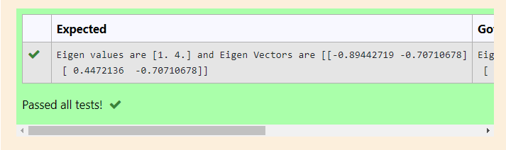

# EIGENVALUES-AND-EIGENVECTORS
## Aim:
To write a python program to find the Eigenvalues and Eigen Vectors
## Equipment’s required:
1. 	Hardware – PCs
2. 	Anaconda – Python 3.7 Installation / Moodle-Code Runner
## Algorithm:
### Step1 : import numpy as np
### Step 2: A=np.array([[k,l],[g,h]])
### Step 3: b,c=np.linalg.eig(),  we get two results (first is eigenvalue and second is eigenvector) of the given matrix.
### Step 4: print("Eigen values are",b,'and Eigen vectors are",c)

## Program:
~~~
import numpy as np
A=np.array([[2,2],[1,3]])
b,c=np.linalg.eig(A)
print("Eigen values are",b,"and Eigen Vectors are",c)
~~~

## Output:

## Result:
Thus the Eigenvalue and Eigenvector is successfully solved using python program
